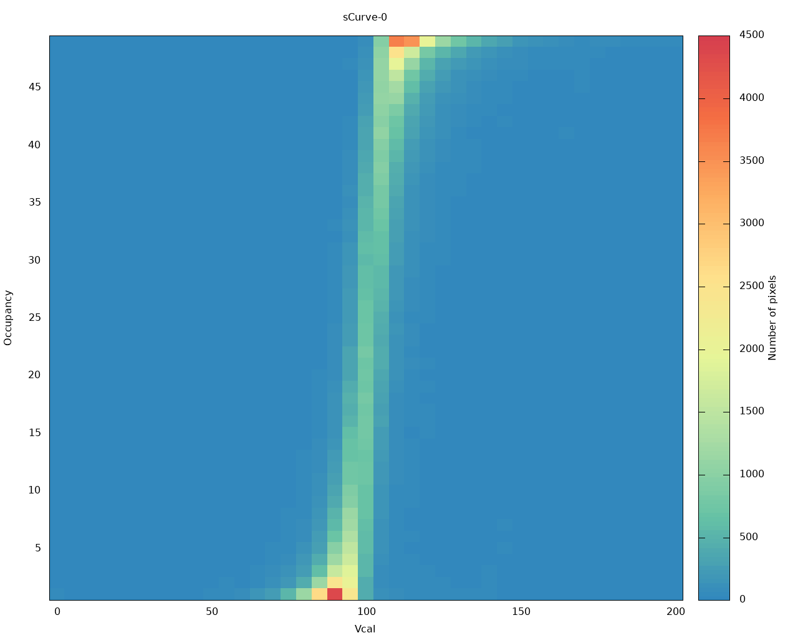

Experimental setup
==================

Experimental setups will inevitably differ from site to site depending
on equipment availability. It is recommended for each organisation to
create a page on this Twiki and describe their setup in a free form in
as much detail as practically needed. General considerations are as
follows.

For the chip:

-   Good quality dual / triple channel laboratory power supply capable
    of providing 1.8V @ 1A on each channel.
-   1-2m long custom made cable with a 4-pin Molex connector to power
    the chip.
-   1-2m long display port to display port (mini display port) to
    connect the chip to BDAQ (YARR) readout.
-   Modern PC with &gt; 8 GB RAM, Quad-core CPU, 1TB HD running CentOS 7
    is highly recommended. sudo right is required for FPGA programming.

In addition for the module:

-   High voltage power supply, e.g. Keithley 2410.
-   Single pin Lemo cable with 00 connector.

Details of setups at each site can be found below:

-   [University of
    Glasgow](CharacterisationSetups#University_of_Glasgow)

Programme FPGA
==============

To programme the FPGA both for YARR and BDAQ system, Vivado is required and can be [downloaded for
free](https://www.xilinx.com/support/download.html) (registration
needed) as either Vivado Webpack or Vivado Lab.

For YARR follow [this link](https://github.com/Yarr/Yarr-fw/blob/master/syn/xpressk7/README.md)
and for BDAQ follow [this
link](https://gitlab.cern.ch/silab/bdaq53/wikis/Hardware/fpga-configuration).

Software installation
=====================

Software packages for [YARR](https://gitlab.cern.ch/YARR/YARR) and
[BDAQ](https://gitlab.cern.ch/silab/bdaq53) are substantially different
with no common ground. Please follow the installation instructions for
each of the system separately, depending on the system at hand.

YARR-based system
-----------------

YARR system has a dedicated portal
[readthedocs](https://yarr.readthedocs.io/en/devel). Please follow the
installations instructions there. For installation from scratch
generally, these steps are needed to be accomplished:

-   Clone and compile YARR software package from the [gitlab
    repository](https://gitlab.cern.ch/YARR/YARR)
-   Install custom PCIe kernel drivers
-   Follow hardware guidance for the type of DAQ card in your possession
-   Run basics scans such as digital, analog and threshold
-   Review acquired results

To enjoy supplementary plotting scripts, install ROOT6 on your CentOS7
PC `sudo yum install root`. The scripts have to be compiled
separately as shown
[here](https://yarr.readthedocs.io/en/devel/rootscripts/). Now when you
are back to this page, it is assumed that you managed to produce some
graphs from analog/digital scans and also familiarised yourself to some
degree with the
[scanConsole](https://yarr.readthedocs.io/en/devel/scanconsole/).

Local database (only available with YARR and Centos 7 at the moment)
--------------------------------------------------------------------

Local database as a concept is introduced to get the users some
experience of using databases. Eventually, all the results produced will
be uploaded to the production database. In the due course of the
production database being worked on, the local database will be used.
For the YARR DAQ system, a fork was created
[here](https://github.com/jlab-hep/Yarr). It includes the latest YARR
software and integrated local database. Please follow the detailed
installation instructions in the [wiki
page](https://github.com/jlab-hep/Yarr/wiki). Mind that eventually this
will be merged into the development and master branches of YARR
software.

This is how the local database and its installation works in general.
[MongoDB](https://www.mongodb.com/) classified as a NoSQL database
program, uses JSON-like documents with schema. It offers the simplicity
of development for databases with a none-straightforward structuring.
More data, files, structures and fields can be added as development
progresses giving flexibility this project needs at this stage of
development. This is very hard to achieve with an SQL database.

Several installation steps are needed, all detailed in the documentation
[here](https://github.com/jlab-hep/Yarr/wiki). A breakdown is below:

-   Installation of MongoDB dependencies
-   Installation of MongoDB
-   Installation of database backend
-   Installation of database viewer (front end)
-   Creation of the RD53A local database.
-   Creation of the RD53A local database user.
-   Creation of the RD53A local database chip configuration.
-   Running scans as usual but with database upload.

BDAQ-based system
-----------------

Follow instructions [here](https://gitlab.cern.ch/silab/bdaq53).

TODO

Test parameters
===============

Disclaimer: Only an overview of what needs to be done is provided here,
use existing documentation to find how to do this.

-	On module reception always check/set the correct configuration of the
	jumpers on the single chip card. Please cross-check the configuration of
	the SCC with [this
	document](https://twiki.cern.ch/twiki/pub/RD53/RD53ATesting/RD53A_SCC_Configuration.pdf).

-	Tests should be done at room temperature with the chip powered in **LDO**
	mode at **1.8V**. Powering the chip to 1.8V in Direct Mode will likely to
	result in permanent damage.
	
-	The only registers that should be changed in the chip configuration file are
	..- IREF (according to waferprobing data, via jumper)
	..- VOLTAGE_TRIM (according to waferprobing data)
	..- MON_BG_TRIM (according to waferprobing data)
	..- VTH_SYNC, VThreshold_LIN, VTH1/2_DIFF (by threshold tuning procedure)
	..- IBIAS_KRUM_SYNC, KRUM_CURR_LIN, VFF_DIFF (by ToT tuning procedure)
	The default chip configuration file will be uploaded here once the baseline and the default DAC values are fixed.

-	Check that Iref is set to 4.0 uA: Remove the jumper labeled IREF IO,
	power up the chip (don't panic if the current consumption drops
	drastically) and measure the current between these pins. If necessary,
	set the 16-bit IREF TRIM jumpers. Remember to put back the IREF IO
	jumper.

-	Measure **VDDA** and **VDDD** and set them to **1.2V** in the software as described
	below.

-	All three FE on the RD53A module is advised to be tuned. The tuning
	protocol is shown below. Please use the 5uA inner layer parameters for the chip configuration file.
	The threshold of all three FE can be tuned to
	**1000e**. This is the recommended value for the travelling module. The ToT
	should be tuned to **8BC** at **10000e**.

Testing protocol YARR
=====================

Follow instructions
[here](https://yarr.readthedocs.io/en/devel/scanconsole/).

To adjust VDDA and VDDD to 1.2V, change `SldoAnalogTrim` and
`SldoDigitalTrim` DACs in the chip config. If you still get ```data not
valid``` errors, adjust VDDA so a value that this error disappears. Once
made sure that the module works, tune all FEs and save the results
before and after tuning.

Synchronous Front End tuning protocol
-------------------------------------

Pre-tuning scans:

-   std\_digitalscan
-   syn\_analogscan
-   syn\_thresholdscan

Tuning:

-   syn\_tune\_globalthreshold
-   syn\_tune\_globalpreamp
-   syn\_tune\_globalthreshold

Post-tuning scans:

-   syn\_thresholdscan
-   sync\_totscan
-   syn\_noisescan

Linear Front End tuning protocol
--------------------------------

Pre-tuning scans:

-   std\_digitalscan
-   lin\_analogscan
-   lin\_thresholdscan

Tuning:

-   lin\_tune\_globalthreshold to 2000e
-   lin\_tune\_pixelthreshold to 2000e
-   lin\_retune\_globalthreshold to 1000e
-   lin\_retune\_pixelthreshold to 1000e
-   lin\_tune\_globalpreamp
-   lin\_retune\_pixelthreshold
-   lin\_tune\_finepixelthreshold

Post-tuning scans:

-   lin\_thresholdscan
-   lin\_totscan
-   lin\_noisescan

Differential Front End tuning protocol
--------------------------------------

Pre-tuning scans:

-   std\_digitalscan
-   diff\_analogscan
-   diff\_thresholdscan

Tuning:

-   diff\_tune\_globalthreshold
-   diff\_tune\_pixelthreshold
-   diff\_tune\_globalpreamp
-   diff\_retune\_pixelthreshold

Post-tuning scans:

-   diff\_thresholdscan
-   diff\_totscan
-   diff\_noisescan

Results review
==============

Let's compare two threshold scans, before and after tuning.  
`YARR/src/data/19060100_diffFE_tune/01_before_tune/XXXX_diff_thresholdscan/TravelChip_sCurve-0_untuned.png`

-   Threshold scan of differential FE before tuning:  
	

`YARR/src/data/19060100_diffFE_tune/03_after_tune/XXXX_diff_thresholdscan/TravelChip_sCurve-0_tuned.png`

-   Threshold scan of differential FE after tuning:
		


Testing protocol BDAQ
=====================

Follow instructions
[here](https://gitlab.cern.ch/silab/bdaq53/wikis/User-guide/General-usage).
You can either execute with e.g. `bdaq53 scan_digital` or
`python scan_digital.py`.

To adjust VDDA and VDDD to 1.2V, change `VREF_A_TRIM` and `VREF_D_TRIM`
in the chip config. Once made sure that the module works, tune all FEs
and save the results before and after tuning. For FE specific scans and
tunings, adjust `'start\_column'` and `'stop_column'` in the scan code
accordingly.

For any tuning, the electron equivalence of injected charge is roughly
10 times the difference between `VCAL_MED` and `VCAL_HIGH`. Pay
attention to the scanning range and adjust `VCAL_HIGH_start` and
`VCAL_HIGH_stop` in the `local_configuration` section of the scan code
accordingly.

Start with a clean data folder, make sure you don't have old mask files
in your folder. The same mask file is going to be written and rewritten
for each FE step.

Tuning protocol
---------------

Pre-tuning scans (can be FE specific if the column range changed
accordingly in the code)

-   scan\_digital
-   scan\_analog
-   scan\_threshold for all FEs

### Synchronous Front End

Tuning:

-   depending on the outcome of the pre-tuning threshold scan, adjust
    `VTH_SYNC`. The [FE testing
    specification](https://twiki.cern.ch/twiki/pub/RD53/RD53ATesting/SYNC_FE_TESTING_SPECIFICATIONS_updated.pdf)
    includes recommended values that might help in the choice of the DAC
    value.
-   sync thresholdscan
-   repeat the steps above if necessary
-   ToT tuning with `tune_tot.py` and adjust the FE and target in the
    code accordingly.
-   repeat threshold tuning again after ToT tuning

Post-tuning scans:

-   syn\_thresholdscan
-   syn\_totscan
-   syn\_noisescan

### Linear Front End tuning protocol

Tuning (tune to 2000e target first, then go lower to 1000e):

-   depending on the outcome of the pre-tuning threshold scan, adjust
    `Vthreshold_LIN` to target 2000e threshold. The [FE testing
    specification](https://twiki.cern.ch/twiki/pub/RD53/RD53ATesting/LIN_AFE_guidelines.pdf)
    includes recommended values that might help in the choice of the DAC
    value.
-   lin thresholdscan
-   repeat the steps above if necessary
-   tune the pixel threshold `meta_tune_local_threshold.py`, adapt the
    `local_configuration` as usual.
-   depending on the outcome of the previous threshold tuning, adjust
    `Vthreshold_LIN` to target 1000e.
-   lin thresholdscan
-   repeat the steps above if necessary
-   tune the pixel threshold `meta_tune_local_threshold.py`, adapt the
    `local_configuration` as usual.
-   ToT tuning with `tune_tot.py` and adjust the FE and target in the
    code accordingly.
-   repeat local threshold tuning again after ToT tuning

Post-tuning scans:

-   lin\_thresholdscan
-   lin\_totscan
-   lin\_noisescan

### Differential Front End tuning protocol

Tuning:

-	depending on the outcome of the pre-tuning threshold scan,
	adjust `Vthreshold_LIN` to target 2000e threshold. The [FE testing
	specification](https://twiki.cern.ch/twiki/pub/RD53/RD53ATesting/Diff_userguide.pdf)
	includes recommended values that might help in the choice of the DAC
	value.
-   diff thresholdscan
-   repeat the steps above if necessary
-   tune the pixel threshold `meta_tune_local_threshold.py`, adapt the
    `local_configuration` as usual.
-   ToT tuning with `tune_tot.py` and adjust the FE and target in the
    code accordingly.
-   repeat local threshold tuning again after ToT tuning

Post-tuning scans:

-   diff\_thresholdscan
-   diff\_totscan
-   diff\_noisescan

Results review
==============

TODO

Frequently asked questions
==========================

Troubleshooting
===============

Check [here](https://yarr.readthedocs.io/en/devel/troubleshooting/)
first. If you cannot find your answers, try the [Mattermost
channel](https://mattermost.web.cern.ch/itkpixel/channels/travellingmodule).
