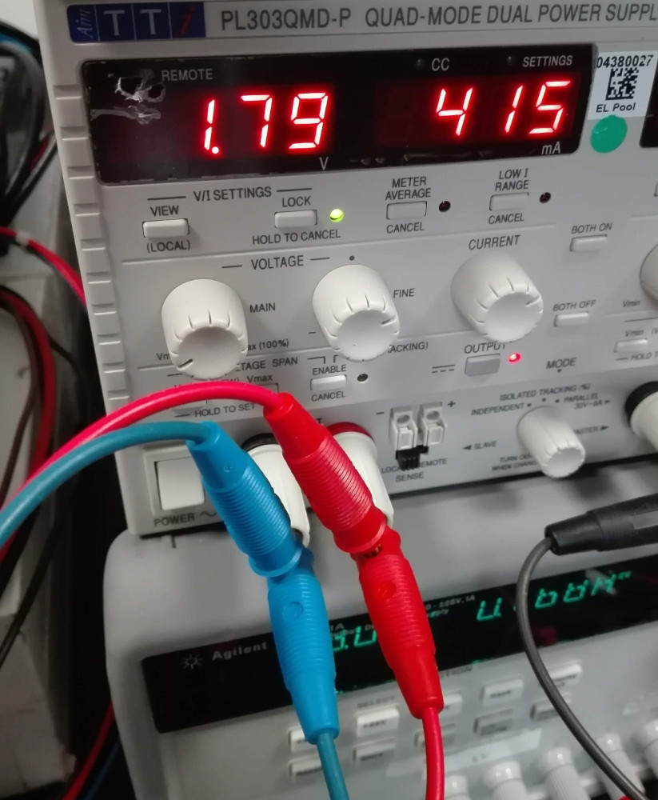

Experimental Setup
==================

Experimental setups will inevitably differ from site to site depending
on equipment availability. It is recommended for each organisation to
create a page on [this twiki](https://twiki.cern.ch/twiki/bin/view/Atlas/CharacterisationSetups) and describe their setup in a free form in
as much detail as practically needed. General considerations are as
follows.

## For the chip

-   Good quality single or dual channel laboratory power supply capable
    of providing 1.8V @ 1A on each channel.
-   1-2m long custom made cable with a 4-pin Molex connector to power
    the chip.
-   1-2m long DisplayPort to DisplayPort (Mini DisplayPort) to
    connect the chip to BDAQ (YARR) readout.
-   Modern PC with &gt; 8 GB RAM, Quad-core CPU, 1TB HD running CentOS 7
    is highly recommended. ```sudo``` rights are required for installing the necessary dependencies, configuring the FPGA etc.

## In addition for the module (chip with sensor):

-   High voltage power supply, e.g. Keithley 2410.
-   Single pin Lemo cable with 00 connector to bias the sensor.

## Pictures

The analog and digital channels of the chip can be powered separately with one channel on the power supply each. They can also be powered together using the same voltage as shown below.




## Readout systems

### YARR
Connect the miniDisplayPort to port A of the Ohio card.

### BDAQ

Connect the DisplayPort connector on the single chip card (SCC) to the "DP_ML 1" port on the BDAQ board.  
Detailed BDAQ hardware setup can be found [here](https://gitlab.cern.ch/silab/bdaq53/wikis/home#hardware-setup).

#### Quick Guide

To power the BDAQ board, you can use either USB or a dedicated 5V powersupply.
Select the powering method accordingly with the jumper next to the VDC input on the board.
When using USB, also a USB 2.0 cable is fine, but the USB powersupply or port has to provide at least 1A of current.

Connect the BDAQ53 base board to the readout PC using a standard Ethernet cable (>= CAT6). For the best experience,
use an additional ethernet interface on your PC (either PCIe or USB3, though it has to be 1000BASE-T – Gigabit ethernet) and the “ETH” port on the BDAQ board next to the USB3 port.


## Temperature Monitoring

There is an NTC next to the chip on the Single Chip Card (SCC) with the testing pins as pointed out on the [photo](images/SCC_labeled.jpg). The datasheet of the NTC can be found [here](https://www.mouser.de/datasheet/2/362/ktthermistor-3035.pdf). It is possible to measure the resistance and convert it to temperature according to the datasheet, or measure the voltage drop using an Arduino.
