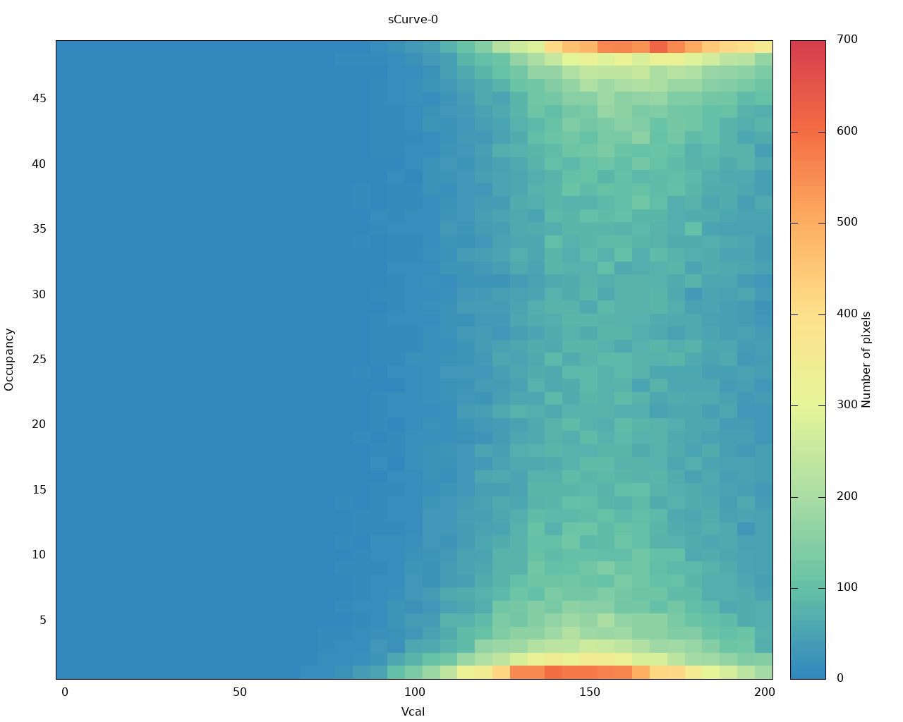
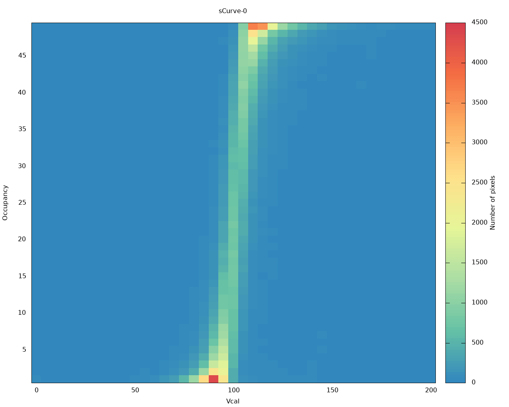

Testing Parameters
===============
Disclaimer: Only an overview of what needs to be done is provided here,
use existing documentation to find how to do this.

-	On module reception always check/set the correct configuration of the
	jumpers on the single chip card. Please cross-check the configuration of
	the SCC with [this document](https://twiki.cern.ch/twiki/pub/RD53/RD53ATesting/RD53A_SCC_Configuration.pdf) or [here](https://yarr.readthedocs.io/en/devel/rd53a/).

-	Tests should be done at room temperature with the chip powered in **LDO**
	mode at **1.8V**. (In direct powering mode use maximum 1.3V, anything higher will likely to
	result in permanent damage.)
	
-	For the moment please use the default chip configuration file provided by the DAQ version you have. For YARR: [default_rd53a.json](files/default_rd53a.json), for BDAQ: [default_chip.yml](files/default_chip.yml)
	The only registers that should be changed in the chip configuration file are
	- IREF (according to waferprobing data, via jumper and trim bits)
	- VOLTAGE_TRIM (according to waferprobing data)
	- MON_BG_TRIM (according to waferprobing data)
	- VTH_SYNC, VThreshold_LIN, VTH1/2_DIFF (by threshold tuning procedure)
	- IBIAS_KRUM_SYNC, KRUM_CURR_LIN, VFF_DIFF (by ToT tuning procedure)  
	<span style="color:red">The default chip configuration file will be uploaded here once the baseline and the default DAC values are fixed.</span>

-	Check that Iref is set to 4.0 uA: Remove the jumper labeled IREF IO,
	power up the chip (don't panic if the current consumption drops
	drastically) and measure the current between these pins. If necessary,
	set the 16-bit IREF TRIM jumpers. Remember to put back the IREF IO
	jumper.

-	Measure **VDDA** and **VDDD** and set them to **1.2V** in the according entries in the chip configuration file.
	- For YARR: change `SldoAnalogTrim` and `SldoDigitalTrim`. If you still get ```data not valid``` errors, adjust VDDA to a value that this error disappears. More information in [FAQ & Troubleshooting](../troubleshooting).
	- For BDAQ: change `VREF_A_TRIM` and `VREF_D_TRIM`.

-	All three FE on the RD53A module is advised to be tuned. The tuning
	protocol is shown below. 
	The threshold of all three FE can be tuned to
	**1000e**. This is the recommended value for the travelling module. The ToT
	should be tuned to **8BC** at **10000e**.

Testing protocol YARR
=====================

Follow instructions
[here](https://yarr.readthedocs.io/en/devel/scanconsole/).

Once made sure that the module works, tune all FEs and save the results
before and after tuning.

Synchronous Front End tuning protocol
-------------------------------------

Pre-tuning scans:

-   std\_digitalscan
-   syn\_analogscan
-   syn\_thresholdscan

Tuning:

-   syn\_tune\_globalthreshold
-   syn\_tune\_globalpreamp
-   syn\_tune\_globalthreshold

Post-tuning scans:

-   syn\_thresholdscan
-   sync\_totscan
-   syn\_noisescan

Linear Front End tuning protocol
--------------------------------

Pre-tuning scans:

-   std\_digitalscan
-   lin\_analogscan
-   lin\_thresholdscan

Tuning:

-   lin\_tune\_globalthreshold to 2000e
-   lin\_tune\_pixelthreshold to 2000e
-   lin\_retune\_globalthreshold to 1000e
-   lin\_retune\_pixelthreshold to 1000e
-   lin\_tune\_globalpreamp
-   lin\_retune\_pixelthreshold
-   lin\_tune\_finepixelthreshold

Post-tuning scans:

-   lin\_thresholdscan
-   lin\_totscan
-   lin\_noisescan

Differential Front End tuning protocol
--------------------------------------

Pre-tuning scans:

-   std\_digitalscan
-   diff\_analogscan
-   diff\_thresholdscan

Tuning:

-   diff\_tune\_globalthreshold
-   diff\_tune\_pixelthreshold
-   diff\_tune\_globalpreamp
-   diff\_retune\_pixelthreshold

Post-tuning scans:

-   diff\_thresholdscan
-   diff\_totscan
-   diff\_noisescan

Results review
==============

Let's compare two threshold scans, before and after tuning.  
`YARR/src/data/19060100_diffFE_tune/01_before_tune/XXXX_diff_thresholdscan/TravelChip_sCurve-0_untuned.png`

-   Threshold scan of differential FE before tuning:  
	

`YARR/src/data/19060100_diffFE_tune/03_after_tune/XXXX_diff_thresholdscan/TravelChip_sCurve-0_tuned.png`

-   Threshold scan of differential FE after tuning:
		


Testing protocol BDAQ
=====================

Follow instructions
[here](https://gitlab.cern.ch/silab/bdaq53/wikis/User-guide/General-usage).
You can either execute with e.g. `bdaq53 scan_digital` or
`python scan_digital.py`.

To adjust VDDA and VDDD to 1.2V, change `VREF_A_TRIM` and `VREF_D_TRIM`
in the chip config. Once made sure that the module works, tune all FEs
and save the results before and after tuning. For FE specific scans and
tunings, adjust `'start\_column'` and `'stop_column'` in the scan code
accordingly.

For any tuning, the electron equivalence of injected charge is roughly
10 times the difference between `VCAL_MED` and `VCAL_HIGH`. Pay
attention to the scanning range and adjust `VCAL_HIGH_start` and
`VCAL_HIGH_stop` in the `local_configuration` section of the scan code
accordingly.

Start with a clean data folder, make sure you don't have old mask files
in your folder. The same mask file is going to be written and rewritten
for each FE step.

Tuning protocol
---------------

Pre-tuning scans (can be FE specific if the column range changed
accordingly in the code)

-   scan\_digital
-   scan\_analog
-   scan\_threshold for all FEs

### Synchronous Front End

Tuning:

-   depending on the outcome of the pre-tuning threshold scan, adjust
    `VTH_SYNC`. The [FE testing
    specification](https://twiki.cern.ch/twiki/pub/RD53/RD53ATesting/SYNC_FE_TESTING_SPECIFICATIONS_updated.pdf)
    includes recommended values that might help in the choice of the DAC
    value.
-   sync thresholdscan
-   repeat the steps above if necessary
-   ToT tuning with `tune_tot.py` and adjust the FE and target in the
    code accordingly.
-   repeat threshold tuning again after ToT tuning

Post-tuning scans:

-   syn\_thresholdscan
-   syn\_totscan
-   syn\_noisescan

### Linear Front End tuning protocol

Tuning (tune to 2000e target first, then go lower to 1000e):

-   depending on the outcome of the pre-tuning threshold scan, adjust
    `Vthreshold_LIN` to target 2000e threshold. The [FE testing
    specification](https://twiki.cern.ch/twiki/pub/RD53/RD53ATesting/LIN_AFE_guidelines.pdf)
    includes recommended values that might help in the choice of the DAC
    value.
-   lin thresholdscan
-   repeat the steps above if necessary
-   tune the pixel threshold `meta_tune_local_threshold.py`, adapt the
    `local_configuration` as usual.
-   depending on the outcome of the previous threshold tuning, adjust
    `Vthreshold_LIN` to target 1000e.
-   lin thresholdscan
-   repeat the steps above if necessary
-   tune the pixel threshold `meta_tune_local_threshold.py`, adapt the
    `local_configuration` as usual.
-   ToT tuning with `tune_tot.py` and adjust the FE and target in the
    code accordingly.
-   repeat local threshold tuning again after ToT tuning

Post-tuning scans:

-   lin\_thresholdscan
-   lin\_totscan
-   lin\_noisescan

### Differential Front End tuning protocol

Tuning:

-	depending on the outcome of the pre-tuning threshold scan,
	adjust `Vthreshold_LIN` to target 2000e threshold. The [FE testing
	specification](https://twiki.cern.ch/twiki/pub/RD53/RD53ATesting/Diff_userguide.pdf)
	includes recommended values that might help in the choice of the DAC
	value.
-   diff thresholdscan
-   repeat the steps above if necessary
-   tune the pixel threshold `meta_tune_local_threshold.py`, adapt the
    `local_configuration` as usual.
-   ToT tuning with `tune_tot.py` and adjust the FE and target in the
    code accordingly.
-   repeat local threshold tuning again after ToT tuning

Post-tuning scans:

-   diff\_thresholdscan
-   diff\_totscan
-   diff\_noisescan

Results review
==============

TODO
