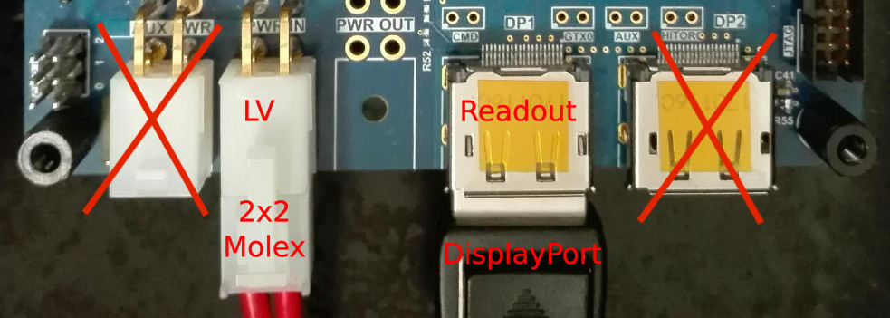
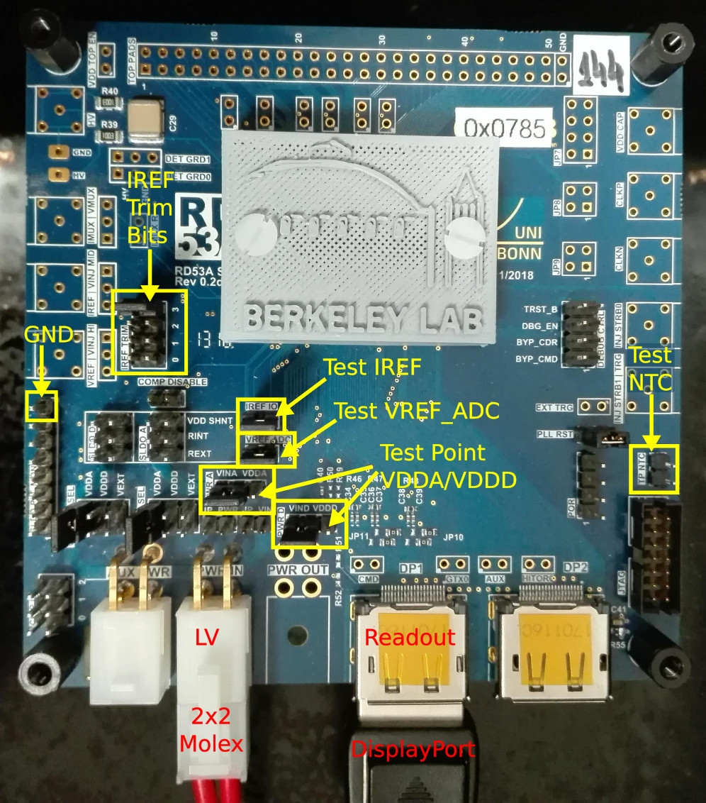

Overview
=========
This page will cover the full testing procedure expected of sites receiving the travelling module.
The procedure consists of:

   * [Reception inspection](#recInsp)
   * [Basic communication](#basicComm)
   * [Trim IREF, VREF and voltage regulators](#trim)
   * [Scans](#scans) (including pre-tune scans, tuning, and post-tuning scans) & plotting

[Here is a checklist](files/travellingModule_checklist.pdf) to keep track of all the tasks. We suggest printing it out to tick off items whilst testing.   

<a id="recInsp"></a>  

Reception inspection
======================
These basic tasks should be performed upon receiving the package:

   1. Please note in the table, [here](https://twiki.cern.ch/twiki/bin/viewauth/Atlas/ContactDetails) when the module was recieved.
   2. Please take photos of the package, as well as performing a visual inspection of the module, being careful to note down (and photograph) any scratches or damage on the board. In addition, please check the wire bond connections under a microscope to make sure there is no detachment during transport.
   3. Check that the jumpers on the Single Chip Card (SCC) are correct. Complete SCC configuration is listed [here](https://twiki.cern.ch/twiki/pub/RD53/RD53ATesting/RD53A_SCC_Configuration.pdf) (Note that `PLL_RST` jumper is missing on the diagrams, which however should be there as mentioned in the recommended configuration.) In particular, note:
      * <span style="color:red">The pin headers labelled `PWR_A` and `PWR_D` (outlined in red box in image) should both be set to `VINA` and `VIND`, respectively. This is done by setting the jumper to connect the left and middle pin for each set of three pins (when the board is orientated as seen in the photo). <b>Setting these jumpers ensures the voltage regulators are used during operation. Setting these incorrectly could lead to permanent damage in the chip.</b></color> 
      * Check that the PLL and CML drivers are being powered from VDDA by setting VDD_PLL_SEL and VDD_CML_SEL to VDDA, respectively (left most pins for each set of 6 in yellow box in photo).  
      * Make sure, for normal operation, that both the `VREF_ADC` and `IREF_IO` pin headers both have jumpers on them.
      * Ensure that there are jumpers solder to pads `JP10` and `JP11`. 
      * Finally, ensure that there is a jumper across the `PLL_RST` pin header.

        
    

<a id="basicComm"></a>

Basic communication
==========================================
With the chip inspected and jumpers set correctly on the SCC, make a quick check of your scanning setup by configuring the chip.

   - **Remember!** Tests should be done at room temperature with the chip powered in **LDO**
	mode at **1.8V**. *If using direct powering (not recommended) DO NOT exceed 1.3V, anything higher will likely to
	result in <b>permanent damage</b>.*

Connect the **Low Voltage (LV)** supply via Molex to the `PWR_IN` connector, as shown in the photo below. If you are unclear as to how to set up your LV supply, please see the instructions in [Experimental setup](expsetup.md). Connect the SCC to your readout system (be it YARR or BDAQ) using a displayport connector, as seen in the photo. 



Next, edit the configuration (config) file used for these tests. BDAQ and YARR use *different* default configs:

   * YARR uses: [rd53a_TravellingChip.json](files/rd53a_TravellingChip.json)
   * BDAQ uses: [rd53a_TravellingChip.cfg.yaml](files/rd53a_TravellingChip.cfg.yaml)

**NB**: To enable an easier comparison between the two systems these configs differ from the default configs found in both systems according to [these guidelines](https://twiki.cern.ch/twiki/bin/viewauth/RD53/RD53ATesting#Guidelines_for_Front_ends). 

### <a id="commTasks"></a>Tasks:

   1. Please change the chip name in the config to the serial number of your chip (e.g. 0x495 for travelling module 3). The chip name in each config file is:
      * ``"Name": `` in YARR
      * ``chip_sn: `` in BDAQ
   2. Run a digital scan and check the output - this is just to see if you can communicate with the chip and to test your basic setup. If you have any chip communication problems it may be that the internal voltages supplied from the LDO is not adequate, which will be fixed in the next step.

<a id="trim"></a>

Trim IREF, VREF_ADC and the voltage regulators
=======================================================



In this step you will trim the reference current and supplied internal voltages by (a) measuring either a current or voltage and (b) modifing the jumpers on the board or parameters in the configuration file. 


## <a id="iref"></a>IREF trim

   * <span style="color:red"><b>CAUTION:</b> Injecting current into the IREF instead of measuring it could permanently damage the chip. <b>DO NOT</b> attempt to measure the current across IREF if you are unsure how to!!</span>

**Tasks**:
   
   1. Power down the LV supply.
   2. On the SCC, remove the jumper across the pin header labeled `IREF_IO` (see photo). 
   3. Set up a current measuring device such as the [Keithley 2400](http://research.physics.illinois.edu/bezryadin/labprotocol/Keithley2400Manual.pdf) and set it up to **measure** a current. Please do not use a simple multimeter for this task as it is not accurate enough. Ensure that the range of the device is set to measure at least 4 μA, on the Keithley this is achieved by setting the measurement display range to at least 10 μA. 
   4. Connect the current-measuring device to the `IREF_IO` pin headers. 
   5. Power up the LV supply as before and measure the current. 
   6. If the current is NOT 4.0 μA you can trim it using the `IRE_TRIM` bits on the SCC. This is a 4-bit register, so you can use multiple jumpers to trim.
   7. **Make note of the final jumper configuration on `IREF_TRIM` and the current measurement.**
   8. Power down the LV supply, disconnect the connectors to `IREF_IO`, and replace the jumper across `IREF_IO`.

## <a id="VREF_ADC"></a>VREF_ADC trim

Measure the jumper with the label ``VREF_ADC`` against GND. Adjust the DACs so that this value is as close to **0.9 V** as possible. This step is essential for the threshold tunings to be correct.

- YARR: ``AdcRefTrim``
- BDAQ: ``MON_BG_TRIM``

## <a id="iref"></a>Internal voltage (VDD) trimming

If you previously were not able to configure the chip, it may be because the internal voltages supplied from the regulators were too low. This step will measure these voltages and show you how to correct them.

**Tasks**: 

   1. Power up the chip and configure it with the same config file you used previously.
   2. Using a voltmeter, probe VDDA/D with respect to ground. You can find the VDDA/D test pin on the third pin of `PRW_A/D` as pointed out on the picture. There are multiple ground references on the board, such as the top-most pin of the `SLDO_PLL_MON` array or any Lemo case.
   3. If the voltage is not 1.2 V, edit the respective trim in the chip config file:
       * YARR: ``SldoAnalogTrim`` for VDDA and ``SldoDigitalTrim`` for VDDD.
	   * BDAQ: ``VREF_A_TRIM`` for VDDA and ``VREF_D_TRIM`` for VDDD.
   4. Re-configure the chip and repeat steps (2) and (3) until VDDA is as close to 1.2 V as possible.
   5. If communication issues still persist, e.g. ``data not valid`` in YARR, try to increase or decrease VDDA slightly until these disappear.
   6. **Record both the voltages measured and the final trim values used.** 

If, however, after trimming the voltages you are still unable to communicate with the chip having tried these measures, please see [FAQ & Troubleshooting](../troubleshooting).

<a id="scans"></a>

Scanning and tuning
====================
After the IREF and voltage references have been trimmed accordingly, we are ready to run some scans. But first:

   1. Power-cycle the chip and record the current drawn when the LV supply is powered, before the chip is configured.
   2. Record the current drawn by the chip on the LV supply after the chip is configured. 

For the travelling module, we require that all three FE variants (synchronous, linear and differential) on RD53A module are tuned. Whilst running these scans, the temperature of the chip should be monitored via the `TP_NTC` pin header (see experimental setup for details). This temperature log, as well as the output of the scans listed below, should all be saved to the database. 
The general scan procedure is as follows:

   * **Pre-tuning scans** should be run over all frontends: 

      * Digital scan
      * Analog scan
      * Threshold scan
   
   * **Tunings** should be performed on each frontend separately. The threshold of all three FE can be tuned to **1000e**. For the linear frontend the tuning has to start with _2000e_ and retuned to _1000e_ for both global and pixel threshold tunings. The ToT should be tuned to **8BC** at **10000e**:

      1. Global threshold tuning
      2. Pixel threshold tuning (not for syncFE)
      3. Time over threshold tuning
      4. Re-adjust pixel threshold (not for syncFE)
   
   * **Post-tuning** scans should be run over all frontends:

      * Threshold scan
      * ToT scan
      * Noise scan

   * **Post processing (YARR ONLY)**: plot threshold and noise distributions with ROOT scripts.

Either YARR or BDAQ can be used to run these scans. The rest of this page describes how to do this with both systems. When running threshold scan, make sure the range of injected charge covers the expected threshold. The conversion is approximately 1 DAC = 10 electrons.

- YARR: ``InjVcalDiff``
- BDAQ: the difference between ``VCAL_MED`` and ``VCAL_HIGH``


## Testing with YARR

Use the [scanConsole](https://yarr.readthedocs.io/en/latest/scanconsole) for all tunings and scans following [this tuning routine](https://yarr.readthedocs.io/en/latest/rd53a#tuning-routine).
Run each scan and tuning **by hand**, observe the output in the terminal and look at the plots after scanConsole is finished. Look into the chip configuration and make sure the threshold DAC for each frontend makes sense.  
For pixel tuning, make sure to run ``FE_tune_finepixelthreshold.json`` after ``FE_retune_pixelthreshold.json`` for each frontend.  
Before running the noise scan, please look into the pixel configuration section in the chip configuration file and make sure that not all pixels are disabled. If they are, simply run another digital scan with ``-m 1`` to reset the enable mask followed by a normal analog scan.  
Please use the [ROOT scripts](https://yarr.readthedocs.io/en/latest/rootscripts) (Threshold and NoiseMap) to produce fitted plots which show separate the data for each FE in pdf format and only the good pixels in differential frontend.


## Testing with BDAQ
=====================

Follow instructions
[here](https://gitlab.cern.ch/silab/bdaq53/wikis/User-guide/General-usage).
You can either execute with e.g. ``bdaq53 scan_digital`` or
``python scan_digital.py``.

Once made sure that the module works, tune all FEs
and save the results before and after tuning. For FE specific scans and
tunings, adjust ``'start_column'`` and ``'stop_column'`` in the scan code
accordingly.

Pay attention to the scanning range and adjust `VCAL_HIGH_start` and
``VCAL_HIGH_stop`` in the ``local_configuration`` section of the scan code
accordingly.

Start with a clean data folder, make sure you don't have old mask files
in your folder. The same mask file is going to be written and rewritten
for each FE step.

Pixel threshold tuning uses ``meta_tune_local_threshold.py``.


<a id="other"></a> Detailed instructions:
-------------------------------------------
### <a id="other2"></a>Preparing the module

Observe the BDAQ board. On the FPGA daughterboard there should be 4 LEDs labeled 0-3. LEDs 0 and 1 should be lit up, while LED 3 should be off and LED 4 should be flashing. Once you turn on the powersupply of the SCC, LED4 should stop flashing and either turn off permanently or all four LEDs should be constantly on.


### <a id="other3"></a>Trimming your chip
=======

### Trimming your chip

In addition to trimming VREF_ADC and VDDA/D by hand as described above, you can acquire these settings by either using the ``calibrate_vref.py`` and ``calibrate_vref_adc.py`` routines of BDAQ53.


### <a id="other4"></a>Preparing the module configuration file

Download the default chip configuration file from above and make a copy of it, naming it according to the chip you are testing. For example, if you have travelling module #1 with chip serial number 0x0494, name your copy ``0x0494.cfg.yaml``. Open your freshly created copy and enter the optimal trimbit settings you acquired in the last step in the trim section of the file.
Make sure that the global threshold DACs are set to a safe threshold of >3000e: e.g. VTH_SYNC: 390, Vthreshold_LIN: 415, VTH1_DIFF: 600.
The file will be automatically picked up if its name matches the chip serial number you enter into testbench.yaml in the next step. 


### <a id="other5"></a>Preparing the output directory
Create a directory on your PC that will be used for all BDAQ53 output files. Open ``bdaq53/bdaq53/testbench.yaml`` with any text editor and in the **general section**, set

- chip_sn to the serial number of the chip / module you are going to test,
- output_directory to the directory you just created.
- Make sure, chip_configuration is set to ``‘auto’``.

Copy the configuration file you downloaded or created in the previous step to the output directory. This way, the configuration file is used for the very first scan. After that, the configuration is passed through consecutive scans.

### <a id="other6"></a>Testing the setup

To make sure everything works as expected, test the setup by changing to ``bdaq53/bdaq53/scans`` and opening ``scan_digital.py``. Verify that the region of interest is defined as  
```yaml
	'start_column': 0,
	'stop_column': 400,
	'start_row': 0,
	'stop_row': 192,
```
This means that the whole pixel matrix will be scanned. Start the scan by running
```bash
	$ python scan_digital.py
```
Check the output: In the very beginning it should tell you which chip configuration file it is using. Verify that this is the file you downloaded or created in the previous section. Let the scan finish and open the output .pdf file. Double check that the correct chip serial number is displayed in the first sentence on the first page. Scroll to the second page. The **Event status** histogram should be empty. Scroll to the third page. The **Occupancy** map should be homogeneously yellow, showing an occupancy of 100 hits for every pixel. The total amount of hits should be \sum = 7680000, or 76800 pixels with 100 hits each.
Congratulations, you are ready to begin testing the module.
