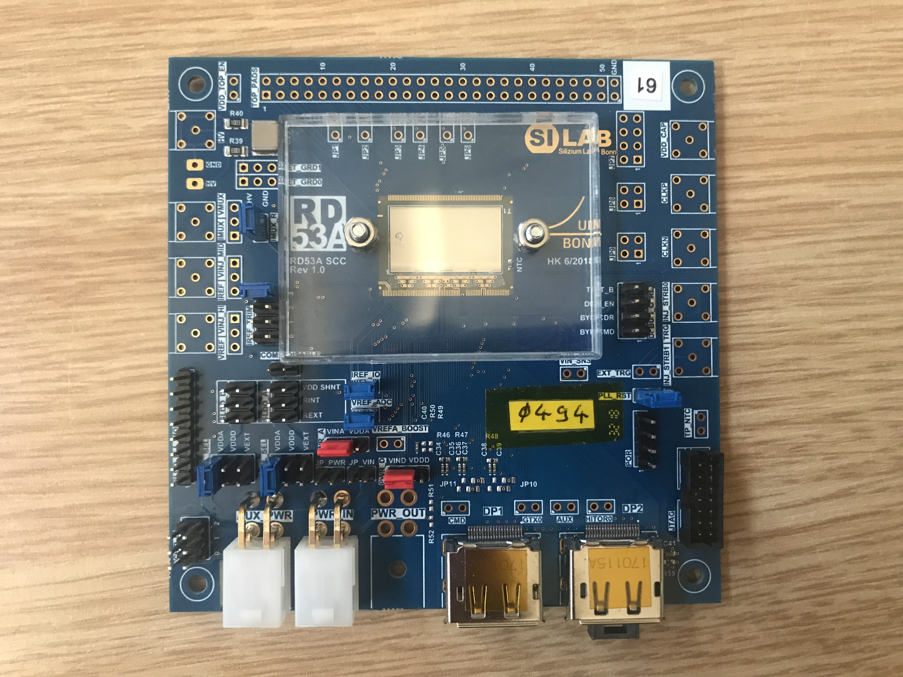
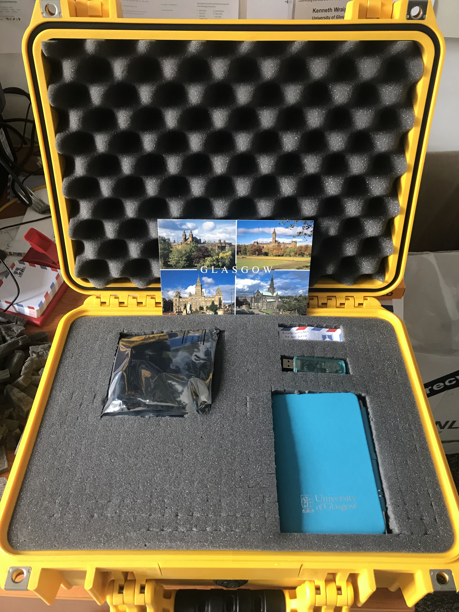
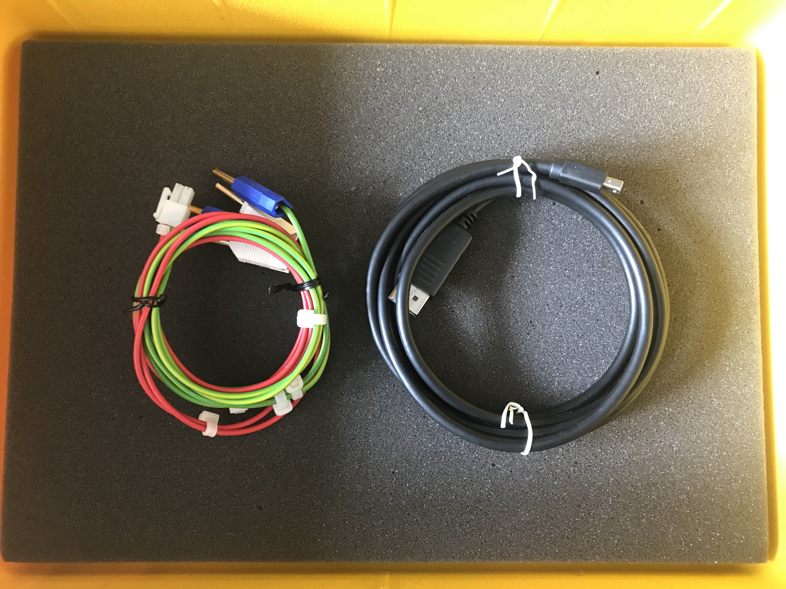
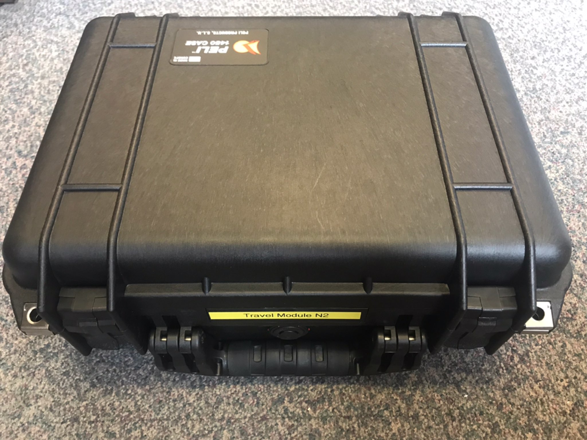
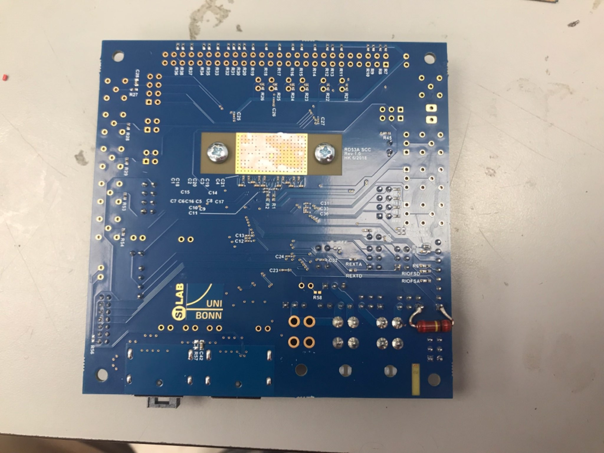

Travel pack
===========

The travel pack consists of several items all enclosed in a bright
yellow Pelican case. Please familiarise yourself with the content
[here](https://twiki.cern.ch/twiki/bin/view/Atlas/TravelPack).

Chip 1
------

Chip SN: 0x0494  
Photopgraphs of the chip  

Content of the Travel pack \#1 before shipping  

Visual photo of the case before shipment  

There is also a secret compartment under the foam. Please use at your
discretion. I (Dima Maneuski) put DP to DP mini and power cable for
Edinburgh there.

Chip 2
------

Chip SN: 0x0D72 (?) Wafer13-7-2
Known peculiarities: none

Content of the Travel pack \#1 before shipping  

Visual photo of the case before shipment  
  

Chip 3
------

Chip SN:  
Known perculiarities: has VDDA hack with 200kOhm resistor  

Module 1
--------

Chip SN:  
sensor information   
Known peculiarities

Module 2
--------
Chip SN:  
sensor information  
Known peculiarities

Module 3
--------
Chip SN:  
sensor information  
Known perculiarities
