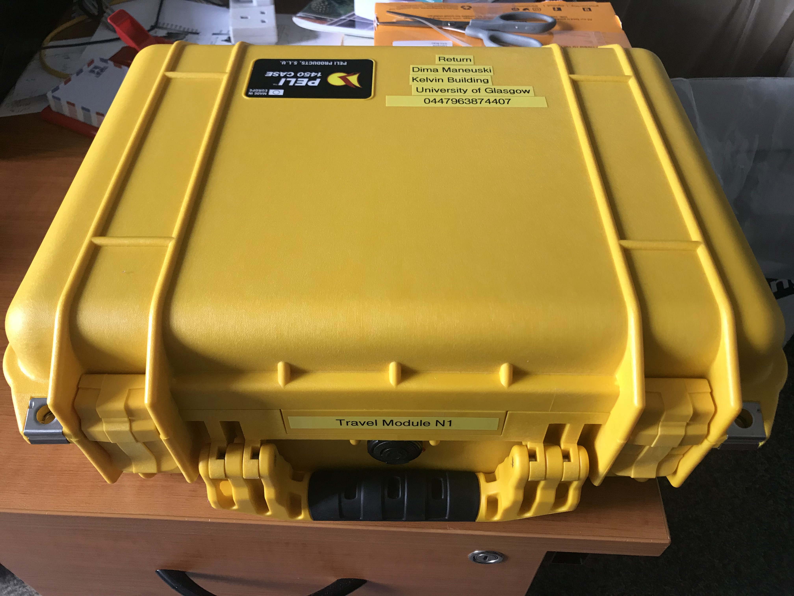

Travelling Chips and Modules
============================

The travel pack consists of several items all enclosed in a bright
yellow Pelican case. Please familiarise yourself with the content
[here](https://twiki.cern.ch/twiki/bin/view/Atlas/TravelPack).

Padlock
-------

A padlock has a 4 digit key code:  
6508 - has two correct digits but neither are in the correct place  
7213 - Has one correct digit but it's in the wrong place  
3891 - Has no correct digits  
5217 - Has two correct digits, both in the correct place.  
All 4 digits in the key are different  
What is the code for the padlock  

Temperature Logger
------------------
Details on the temperature logger can be found [here](https://mindsetsonline.co.uk/shop/mini-temperature-datalogger)

Chip 1
------

Chip SN: 0x0494  
Photopgraphs of the chip  

Content of the Travel pack \#1 before shipping  

Visual photo of the case before shipment  

There is also a secret compartment under the foam. Please use at your
discretion. I (Dima Maneuski) put DP to DP mini and power cable for
Edinburgh there.

Chip 2
------

Chip SN: 0x1F72  
Known peculiarities: none  
Wafer probing data:

-	IREF_TRIM: 7
-	VREF_A_TRIM: 23
-	VREF_D_TRIM: 17
-	MON_BG_TRIM: 12

Content of the Travel pack \#2 before shipping  

Visual photo of the case before shipment  
  

Chip 3
------

Chip SN: 0x0495  
Known perculiarities: has VDDA hack with 200kOhm resistor  

Content of the Travel pack \#2 before shipping  

Visual photo of the case before shipment  
  

Module 1
--------

Chip SN:  
sensor information   
Known peculiarities

Module 2
--------
Chip SN:  
sensor information  
Known peculiarities

Module 3
--------
Chip SN:  
sensor information  
Known perculiarities
