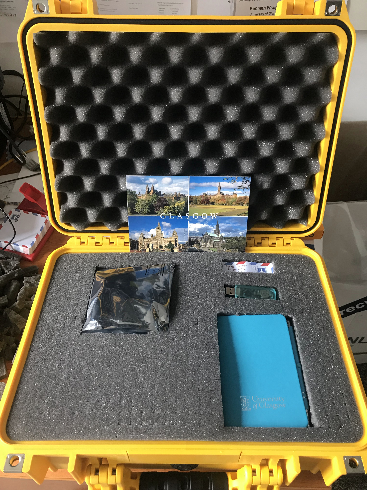
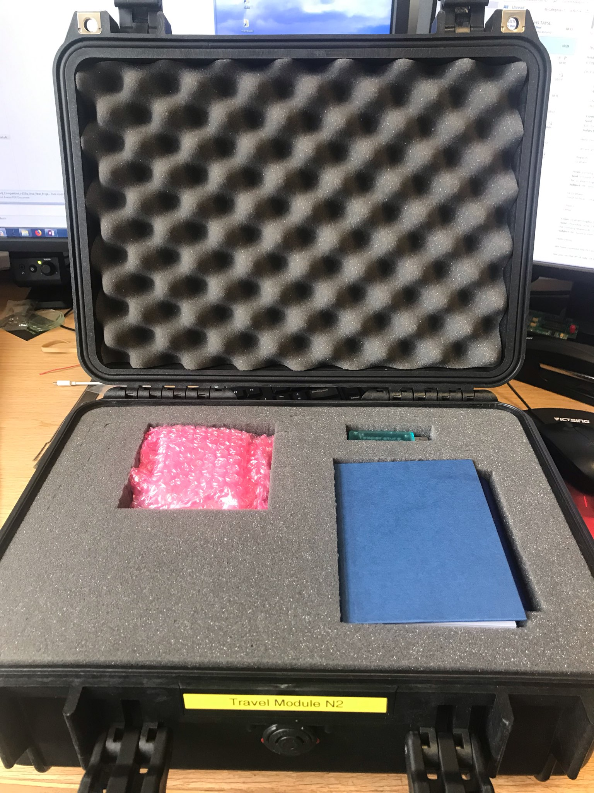

Travelling Chips and Modules
============================

The travel pack consists of several items all enclosed in a bright
yellow Pelican case. Please familiarise yourself with the content
`here <https://twiki.cern.ch/twiki/bin/view/Atlas/TravelPack>`__.

Padlock
-------

| A padlock has a 4 digit key code:
| 6508 - has two correct digits but neither are in the correct place
| 7213 - Has one correct digit but it's in the wrong place
| 3891 - Has no correct digits
| 5217 - Has two correct digits, both in the correct place.
| All 4 digits in the key are different
| What is the code for the padlock

Temperature Logger
------------------

Details on the temperature logger can be found
`here <https://mindsetsonline.co.uk/shop/mini-temperature-datalogger>`__

Chip 1
------

| Chip SN: 0x0494
| Photopgraphs of the chip
| |0x0494|

| Content of the Travel pack #1 before shipping
| |Travel pack before shipping|

| Visual photo of the case before shipment
| |Visual photo of the case before shipment|

There is also a secret compartment under the foam. Please use at your
discretion. I (Dima Maneuski) put DP to DP mini and power cable for
Edinburgh there. |secret compartment|

Chip 2
------

| Chip SN: 0x1F72
| Known peculiarities: none
| Wafer probing data:

-  IREF\_TRIM: 7
-  VREF\_A\_TRIM: 23
-  VREF\_D\_TRIM: 17
-  MON\_BG\_TRIM: 12

.. figure:: images/GLA_Chip_N2.png
   :alt: 0x0D72

   0x0D72

| Content of the Travel pack #2 before shipping
| |Travel pack before shipping|

| Visual photo of the case before shipment
| |Visual photo of the case before shipment|

Chip 3
------

| Chip SN: 0x0495
| Known perculiarities: has VDDA hack with 200kOhm resistor

.. figure:: images/GLA_Chip_N3.jpg
   :alt: 0x0495

   0x0495

.. figure:: images/GLA_Chip_N3-hack.jpg
   :alt: hack

   hack

| Content of the Travel pack #2 before shipping
| |Travel pack before shipping|

| Visual photo of the case before shipment
| |Visual photo of the case before shipment|

Module 1
--------

| Chip SN:
| sensor information
| Known peculiarities

Module 2
--------

| Chip SN:
| sensor information
| Known peculiarities

Module 3
--------

| Chip SN:
| sensor information
| Known perculiarities

.. |0x0494| image:: images/GLA_Chip_N1.jpg

.. |Visual photo of the case before shipment| image:: images/GLA_CaseToShip_N1.jpg
.. |secret compartment| image:: images/GLA_CaseSecret_N1.jpg

.. |Visual photo of the case before shipment| image:: images/GLA_CaseToShip_N2.jpg
.. |Travel pack before shipping| image:: images/GLA_CaseOpened_N3.jpg
.. |Visual photo of the case before shipment| image:: images/GLA_CaseToShip_N3.jpg

